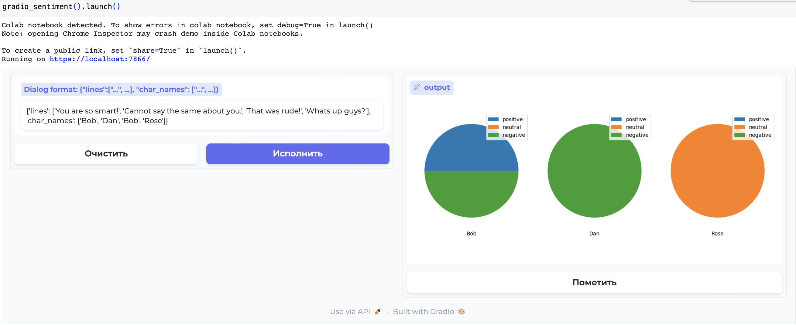
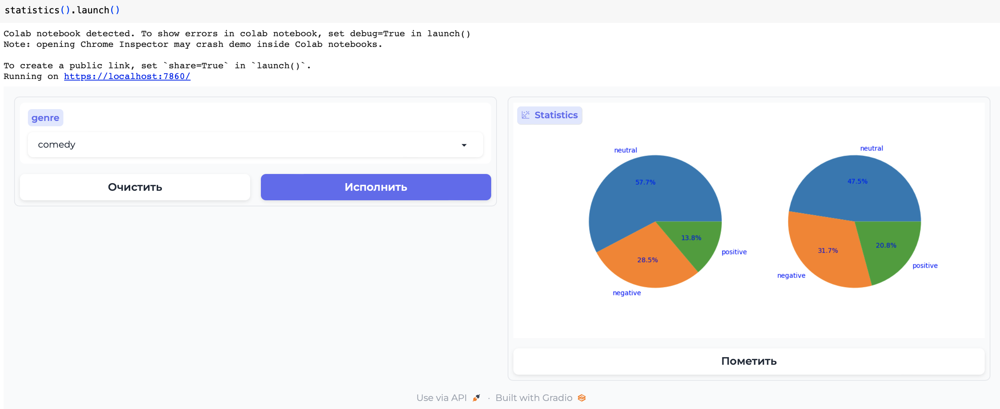

# dl_frameworks_dp

Домашнее задание 2.

Код реализован на **pandas**.
Датасет [Movie Dialog Corpus](https://www.kaggle.com/datasets/Cornell-University/movie-dialog-corpus)

Project Organization
------------

    ├── README.md                        <- The top-level README for developers using this project.
    │
    ├── data
    │   ├── processed                    <- After preprocessing datasets for modeling will be here.
    │   ├── raw                          <- Add original data here.
    │   └── make_dataset.py              <- Script for data preparation.
    │
    ├── notebooks                        <- Jupyter notebooks with experiments and logs.
    │
    ├── gradio                           <- Task 1. Analysis of dialogues with Gradio
    │   ├── Sentiment_gradio.ipynb       <- Jupyter notebooks with Sentiment Task.
    │   └── Genre_Emotions_gradio.ipynb  <- Jupyter notebooks with Genre + Emotions Task.
    │
    └──streamlit                         <- Task 2. Streamlit
        ├── app2_1.py                    <- Script with Speaker + Emotions Task.
        └── app2_2.py                    <- Script with Interface for annotation Task.

--------
### Sentiment Task

### Genre + Emotions Task

